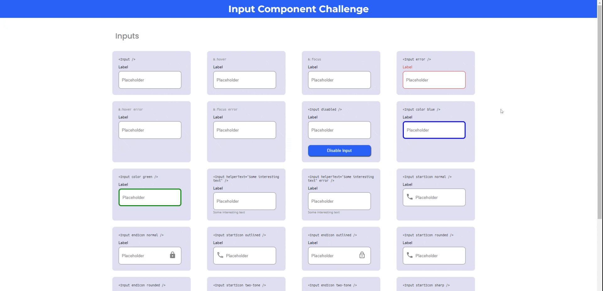

<h1 align="center">Button Input Challenge</h1>

<div align="center">
   Solution for the input component challenge using React.js - carlos.pabon.code - <a href="http://devchallenges.io" target="_blank">Devchallenges.io</a>.
</div>

<div align="center">

  <h3>
    <a href="https://awesome-golick-7c5779.netlify.app/">
      Solution
    </a>
    <span> | </span>
    <a href="https://devchallenges.io/challenges/TSqutYM4c5WtluM7QzGp">
      Challenge
    </a>
  </h3>
</div>

## Table of Contents

- [Overview](#overview)
  - [Built With](#built-with)
- [Features](#features)

## Overview



The steps I made to accomplish the challenge started with the creation of the components, after that I create the structure of the challenge (JSX), then I searched and organized all the resources I needed (Colors,fonts and icons), then I continue with the creation of the css required, I used styled components. Finally, I added the logic and code to the interactive components.

I used React.js, I learned to work faster than before and more organized, the design in figma makes things easier. I had to learn to use the pseudo class focus-within, to accomplish the change of color of the label and the helper text on focus.

### Built With

- [React.js](https://es.reactjs.org/)
- [Styled components](https://styled-components.com/)

```sh
npm install --save styled-components
```

- [MUI Icons Material](https://mui.com/components/material-icons/)

```sh
npm install @mui/icons-material
```

- [Emotion](https://emotion.sh/docs/introduction)

```sh
npm install @emotion/react
npm install @emotion/styled
```

## Features

You can see error state, choose to disable and enable the input, choose to have helper text, choose to have an icon on the left or right with its variants, you can have different input sizes and different input colors, see the visual indicators of the hover and focus states.
